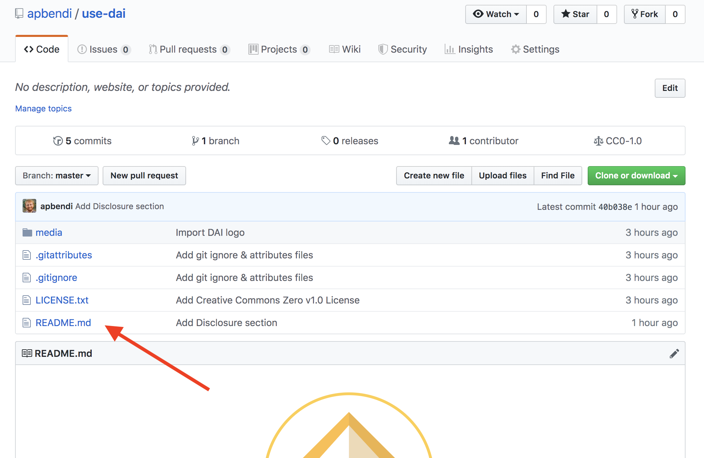
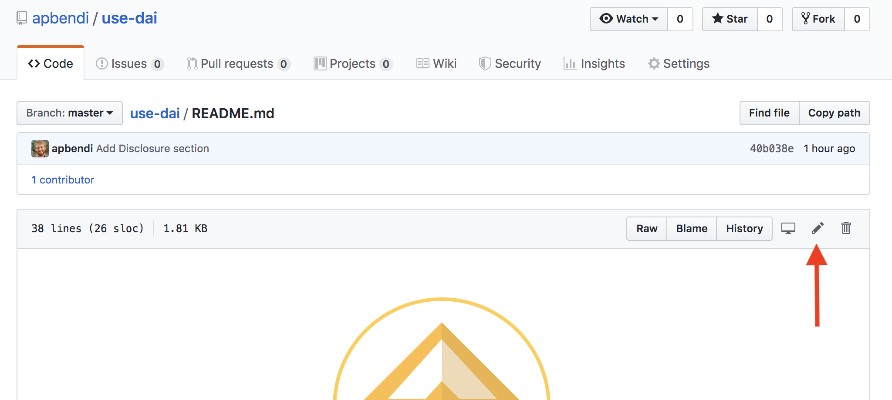
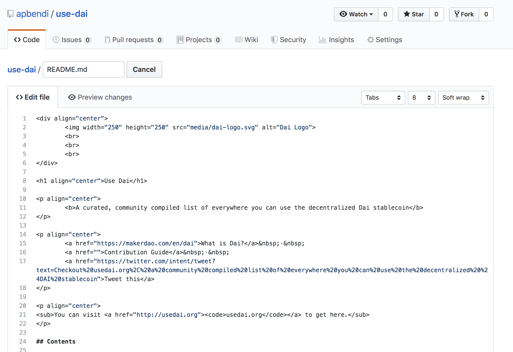
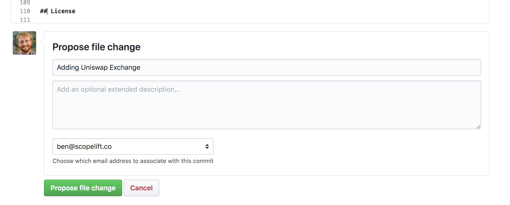

# Contributing to the Use Dai list

Use Dai is a community driven effort! Contributions to the list are welcomed and encouraged from all.

## Guidelines

**To qualify for inclusion on the Use Dai list, a business or service should**:

* Have a recently updated website explaining the nature of its business/service
* Accept the Dai currency for payment in exchange for goods or services rendered, or otherwise allow Dai to be utilized as money, such as for lending or other financial products
* Comply with all laws and statutes of the jurisdiction(s) in which it operates

**Each contribution should**:

* Conform to the following format: `Link - Short description of business or project`, for example:
  * [Maker](https://cdp.makerdao.com/) - Provides loans in Dai against collateralized ETH`
* Be **succinct** and **straightforward**. Avoid flowery language or marketing jargon.
* Follow strict alphabetical ordering for sections, sub-sections, and entries
* Include the project under the appropriate section & sub-section, adding them as needed
* Update the table of contents if new a section or subsection was added

## Instructions

If you have something to the Use Dai list this is how you do it.

You'll need a [GitHub account](https://github.com/join)!

1. Access the list's GitHub page. For example: https://github.com/apbendi/use-dai
2. Click on the `README` file: 
3. Now click on the edit icon. 
4. You can start editing the text of the file in the in-browser editor. Make sure you follow guidelines above. You can use [GitHub Flavored Markdown](https://help.github.com/articles/github-flavored-markdown/). 
5. Say why you're proposing the changes, and then click on "Propose file change". 
6. Submit the [pull request](https://help.github.com/articles/using-pull-requests/)!

### Updating your Pull Request

You may be asked to edit your Pull Request before it is included. This is normally due to spelling errors or because your PR didn't match the list guidelines.

[Here](https://github.com/RichardLitt/knowledge/blob/master/github/amending-a-commit-guide.md) is a write up on how to change a Pull Request, and the different ways you can do that.