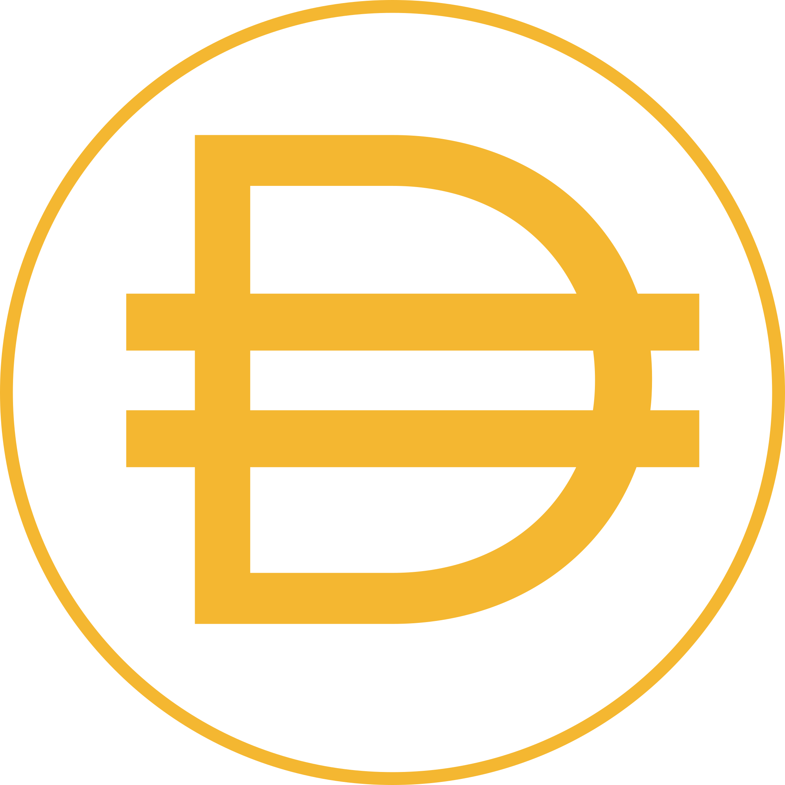

	
	 
	 
	 

<h1 align="center">Use Dai</h1>

	<b>A curated, community compiled list of everywhere you can use the decentralized Dai stablecoin</b>

	<a href="https://makerdao.com/en/dai">What is Dai?</a>&nbsp;·&nbsp;
	<a href="CONTRIBUTING.md">Contribution Guide</a>&nbsp;·&nbsp;
	<a href="https://twitter.com/intent/tweet?text=Checkout%20usedai.org%2C%20a%20community%20compiled%20list%20of%20everywhere%20you%20can%20use%20the%20decentralized%20%24DAI%20stablecoin">Tweet this</a>

You can visit <a href="http://usedai.org"><code>usedai.org</code></a> to get here.

## Contents

#### Categories

* [Agencies and Consultancies](#agencies-and-consultancies)
* [Charity and Tipping](#charity-and-tipping)
* [E-commerce](#e-commerce)
* [Finance, Investment, and Trading](#finance-investment-and-trading)
* [Freelancers](#freelancers)
* [Other](#other)

#### Miscellany

* [Disclosure](#disclosure)
* [License](#license)

## Agencies and Consultancies

* [ScopeLift](https://www.scopelift.co/) - Software consultancy with expertise in crypto, web, and native mobile development.

## Charity and Tipping

* [NeedsList](https://needslist.co/donate) - Real-time needs registry for disaster relief and humanitarian aid.
* [SendCrypto Bot](https://sendcryptobot.io/) - Tip with Dai on Twitter, Slack and Reddit.
* [Unicef Ventures, France](https://lp.unicef.fr/donate-dai/) - Invests in frontier technologies, and how they could be used to solve humanity’s greatest challenges.

## E-commerce

* [Bidali](https://giftcards.bidali.com/buy-giftcards-with-dai/) - Buy gift cards with Dai.

## Finance, Investment, and Trading

* [Compound](https://compound.finance/) - Earn interest on Dai via algorithmic Money Markets.
* [Dharma](https://www.dharma.io) - Lend your Dai and earn interest.
* [Maker](https://cdp.makerdao.com/) - Get loans in Dai against collateralized ETH.
* [Nuo](https://app.nuo.network/) - Simplest way to margin trade.

## Excahgnes

* [Uniswap](https://uniswap.io/) - Decentralized protocol for swapping ETH, Dai and other tokens.
* [KyberSwap](https://kyberswap.com/) - A simple way to exchange tokens. No deposit, oo orderbook, competitive spreads.
* [token.store ETH](https://token.store/) - Decentralized exchange for ERC-20 tokens with an open smart contract. Features on-chain order-matching and settlement.
* [dYdX](https://trade.dydx.exchange/) - The most powerful open trading platform for crypto assets.

## Freelancers

## Other

* [Gitcoin](https://gitcoin.co/) - Platform for crowdfunding and freelance developers for your software projects.

## Disclosure

This list is a community project and is in no way affiliated with Maker or any other entity. Nothing in this repository may be construed as legal or investment advice, nor as an endorsement of any of the businesses or projects contained herein. Holding and/or using Dai-- or any other cryptocurrency-- has risks. No contributor to this project may held liable for lost or stolen funds, or any other damages that may be incurred by using Dai or interacting with the projects listed herein. Contributors to this repository may hold positions in crypto assets. Please consult with your own legal, financial, and tax professionals.

## License

To the extent possible under law, [Ben DiFrancesco](https://twitter.com/bendifrancesco) has waived all copyright and related or neighboring rights to this work.

The copyright of the Dai Logo is not held by this project. It is used here in accordance with the doctrine of fair use.